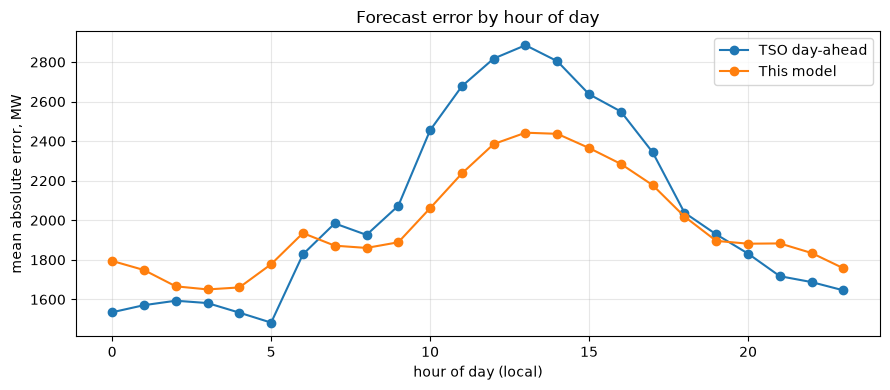
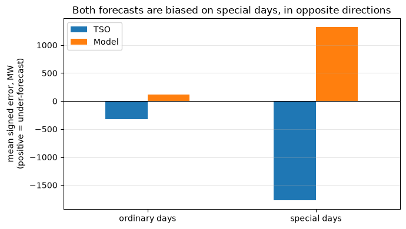
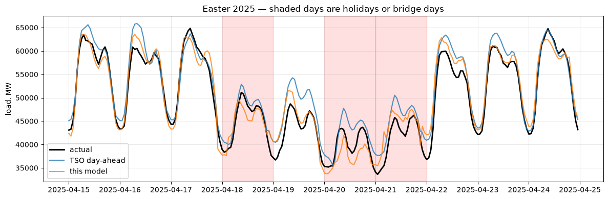
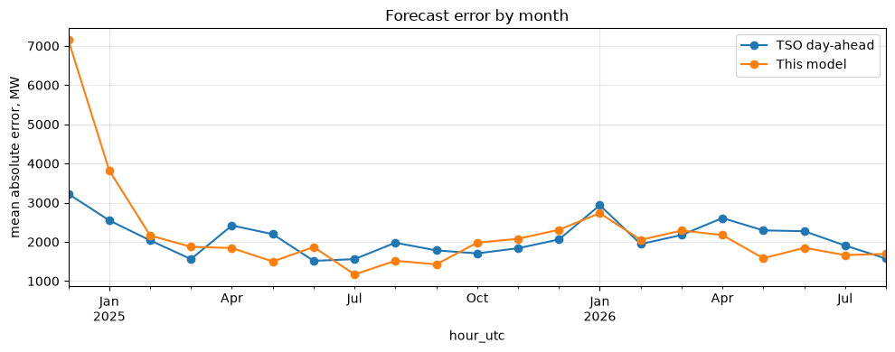

# European electricity load: a tested data platform

A pipeline that pulls German electricity load from a live public API, lands it
in BigQuery, transforms it with dbt under test, and forecasts next-day demand —
evaluated against the forecast the grid operator itself published.

No API key is required. Clone it and it runs.

## The point

Most forecasting projects report a MAPE with nothing to compare it against. Is
3% good? Without a reference you cannot say.

The German transmission system operator publishes its own day-ahead load
forecast, and that forecast is archived and retrievable. So there is an
external baseline that was not chosen for being easy to beat: a professional
forecast, made in advance, by people with weather data and industrial
schedules this project does not have.

Everything here is built around making that comparison mean something.

## Headline result

Walk-forward backtest, 13,127 hours, no feature the operator could not also
have had:

| | MAE | MAPE | Bias |
|---|---|---|---|
| TSO day-ahead | 2,019 MW | 3.917% | −628 MW |
| This model | 1,866 MW | **3.581%** | **−40 MW** |

A 9% relative improvement in MAPE, and near-zero bias where the operator
systematically over-forecasts by 628 MW.

The improvement comes entirely from ordinary days (3.479% vs 3.830%). On
holidays and bridge days the two forecasts are level (5.622% vs 5.670%) — and
both are badly biased, in opposite directions.



Both forecasts are accurate overnight and degrade sharply at midday — the
operator peaking at 2,880 MW error at 13:00 against 2,440 MW here. Almost all
of this model's advantage sits in those midday hours, which is where behind-
the-meter solar makes load hardest to predict and where neither forecast has
weather data.

## What the data was allowed to overturn

### A hypothesis that did not survive

Exploration showed the operator's error is not uniform: 3.87% on average, but
12–14% on Easter Sunday, Labour Day and the bridge day after Ascension. The
worst months are January, May, November and December — all holiday-dense.
February and October, with almost no German public holidays, are the best.

The hypothesis was that explicit holiday features would close that gap.

**They did not.** With 624 special-day hours out of 22,991, there is too little
signal to learn holiday behaviour from. The model matches the operator on those
days rather than beating them, and the real improvement turned out to be
general rather than holiday-specific.

The finding that replaced it is more interesting: on special days the operator
over-forecasts by 1,889 MW and this model under-forecasts by 1,488 MW. Both are
systematically wrong by more than a gigawatt, in opposite directions, where on
ordinary days both are near-unbiased.





Easter 2025, with holidays and bridge days shaded. On the ordinary days either
side, all three series are nearly indistinguishable. On Good Friday and Easter
Monday the operator's forecast sits visibly above actual load — predicting
demand that does not arrive — while this model tracks closer but overshoots the
overnight troughs.

### A result that was too good

Including `lag_1d` — load at the same hour yesterday — improves MAE from 1,866
to 1,561 MW and MAPE from 3.581% to 3.000%. That is roughly 80% of the apparent
advantage over the operator.

It is excluded from the headline. A day-ahead forecast is published before the
previous day's load has settled — this project's own revision tracking shows
actuals arriving up to several days late — so using yesterday's final value
gives the model information the operator did not have.

The feature is not deleted; it is behind a flag:

```bash
python -m model.train --allow-leakage
```

so the size of the effect is reproducible rather than asserted.

### A metric that was misleading

Weekend MAPE (4.6%) looks much worse than weekday (3.5%). Most of that is
arithmetic: absolute error barely moves (2,149 vs 1,962 MW) while load drops
16%, and MAPE divides by load.

Special days are different — absolute error genuinely rises 35% (2,688 vs
1,983 MW). That degradation is real, not a denominator effect.

MAE and MAPE are therefore reported together throughout. MAPE alone would have
produced the wrong conclusion about weekends.

## The bug that would have invalidated everything

The API exposes load in two endpoints. The first attempt used `/v2/total_power`,
whose load series is `load_incl_self_consumption` — grid load *plus*
electricity generated and consumed on-site by industry.

Comparing it against the day-ahead forecast gave differences that were positive
at every single timestamp, clustered near +3,000 MW. That is the signature of a
definitional mismatch, not forecast error: a national TSO does not
underestimate demand by 3 GW every quarter-hour of every day.

`/v2/public_power` reports grid load on the forecast's definition. The same
comparison there gives differences from −2,216 to +1,865 MW with a mean of
+15 MW — which is what real forecast error looks like.

Using the wrong endpoint would have produced a headline claim of beating the
operator by ~7%, entirely as an artefact of measuring a larger quantity. It was
caught by probing the live API before writing the ingestion client, not by
reading the documentation — which still shows v1 response shapes in places.

## Architecture

energy-charts API v2 ──▶ BigQuery power_raw (append-only, partitioned)
(Fraunhofer ISE) │
┌───────────┼───────────────┐
▼ ▼ ▼
stg_load fct_load_revisions assert_residual_load_identity
│
▼
fct_load_hourly ──▶ fct_forecast_accuracy
│
▼
model/train.py


## Design decisions

### The raw layer is append-only

Load figures are revised after publication. Fetched on 2026-08-26, the last
hour of the previous day was missing; by 2026-08-30 it had filled in.

The loader therefore only inserts, never updates. De-duplication to
latest-version-wins happens once, in `stg_load`, as a single window function
that a `unique` test asserts on. `fct_load_revisions` then measures how far
values move after publication and how long they take to settle — which is what
determines how long the pipeline should wait before treating a day as final,
and which is why `lag_1d` is treated as unavailable at prediction time.

Cost: duplicate storage, megabytes at this volume.

### Hourly load is a mean, not a sum

The source publishes instantaneous power in MW at 15-minute resolution. Summing
four readings would report four times the true load. The hourly mean in MW
equals the energy in MWh over that hour, which is the quantity a capacity
planner uses.

Hours built from fewer readings than the interval implies are kept and flagged
`is_complete_hour = false`, not dropped. Dropping them would make a publication
outage look like a collapse in demand.

### Calendar features are local, keys are UTC

Timestamps arrive as local time with an offset. UTC is stored as the join key;
hour-of-day features are derived in Europe/Berlin, because consumption follows
local clocks and a UTC hour-of-day would smear the evening peak across two
hours for half the year.

DST is visible in the data: local midnight on 2024-01-01 is 2023-12-31T23:00Z,
on 2026-08-25 it is 2026-08-24T22:00Z.

### "Holiday" means unusual consumption, not a day off work

Easter Sunday is not a statutory German holiday — Sunday is already
non-working — but it was the second-worst day in the dataset for the operator's
forecast. The feature set therefore flags Easter, the Christmas–New Year
period, and bridge days alongside statutory holidays.

### Cold-start months are reported separately

Over the full backtest the model reaches 3.733% MAPE. In the first backtest
month its error is 7,150 MW — several times worse than the operator — because
it has seen barely one seasonal cycle. Excluding two warm-up months gives
3.581%.

Both numbers are reported. The cutoff is where monthly error stabilises, which
is visible in the error-over-time plot, rather than chosen to flatter the
result.



## Tests

20 dbt tests, all passing.

| Test | Catches |
|---|---|
| `unique` on `observation_key` | Deduplication silently failing, producing double-counted averages |
| `assert_no_missing_hours` | The failure a null check cannot see — an absent row, which shifts every lag feature by one position with no error anywhere |
| `assert_residual_load_identity` | `residual_load` is published as a derived series and equals load − solar − wind to floating-point precision. If that stops holding, an upstream definition changed |
| `accepted_values` on `interval_minutes` | The publication interval moving, which silently changes what an hourly mean represents |
| Source `freshness` | The feed stopping, as distinct from the feed returning bad data |

Severities are deliberate. A handful of trailing nulls warns; a systematic
absence fails.

## Running it

```bash
python -m venv .venv && .venv/bin/pip install -r requirements.txt
gcloud auth application-default login

python -m ingest.load_to_bq --start 2026-08-25 --end 2026-08-25 --dry-run
python -m ingest.load_to_bq --start 2024-01-01 --end 2026-08-29

cd dbt_power && dbt build && dbt docs generate

cd .. && python -m model.train
```

## Layout

ingest/ API client and BigQuery loader
dbt_power/ transformations, tests, lineage
models/staging/ deduplicated, typed, one row per observation
models/marts/ hourly grain, forecast accuracy, revision tracking
tests/ singular tests schema tests cannot express
model/ feature engineering and walk-forward backtest
notebooks/ exploration


## Known limitations

- **No weather data.** Error by hour of day peaks sharply at midday for both
  forecasts (2,880 MW for the operator, 2,440 here), which is almost certainly
  solar variability. Weather features are the obvious next improvement and
  would likely matter more than anything else on this list.
- **Timezone is hardcoded** to Europe/Berlin; a second country needs a lookup.
- **The loader builds a full year in memory** before writing. Fine at this
  volume; would need batching at 10× the history.
- **Monthly retraining**, not daily. 973 daily refits for marginal realism was
  not worth the runtime; the cost is that late-month predictions use a model up
  to 30 days stale, which is conservative rather than flattering.
- **`fct_load_revisions` is currently empty.** Nothing observed so far has been
  revised — the model only becomes informative once the pipeline has run daily
  for some weeks.
- **ENTSO-E is not yet integrated** as a second source.

## Data licence

Source data © Fraunhofer ISE, energy-charts.info, CC BY 4.0.